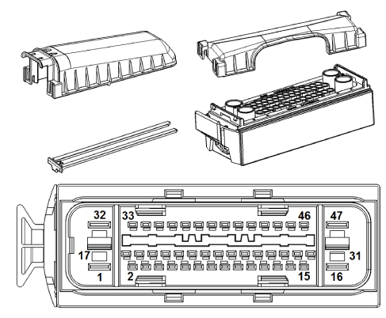

# DSC Unit

## Connector view

Connector X18303, 47-pin natural

Pin assignments at plug connector X18303.

| Pin | Type | Description /Signal type                   | Connection /Measuring notes                |
| :-- | :--- | :----------------------------------------- | :----------------------------------------- |
| 1   | E    | Supply, terminal 30                        | Fuse F65                                   |
| 2   | --   | Not used                                   |                                            |
| 3   | E    | Signal, brake fluid level                  | Brake fluid level switch                   |
| 4   | E    | Brake light switch signal                  | Brake light switch                         |
| 5   | A    | Signal Brake pad wear sensor, front left   | Brake pad wear sensor, front left          |
| 6   | --   | Not used                                   |                                            |
| 7   | --   | Not used                                   |                                            |
| 8   | A    | Signal, processed wheel speed, rear right  | Connector X10186 (rear right wheel speed)  |
| 9   | E    | Signal Brake pad wear sensor, front left   | Brake pad wear sensor, front left          |
| 10  | --   | Not used                                   |                                            |
| 11  | E/A  | Signal F-CAN high                          | CAN-bus connector                          |
| 12  | A    | Signal, processed wheel speed, front right | Connector X10184 (front right wheel speed) |
| 13  | --   | Not used                                   |                                            |
| 14  | A    | Signal, processed wheel speed, front left  | Connector X10183 (front left wheel speed)  |
| 15  | E/A  | Signal PT-CAN low                          | CAN-bus connector                          |
| 16  | M    | Ground                                     | Ground point                               |
| 17  | E    | Signal, terminal 30G                       | Fuse F20                                   |
| 18  | --   | Not used                                   |                                            |
| 19  | --   | Not used                                   |                                            |
| 20  | --   | Not used                                   |                                            |
| 21  | E    | Signal Brake pad wear sensor, rear right   | Brake pad wear sensor, rear right          |
| 22  | --   | Not used                                   |                                            |
| 23  | --   | Not used                                   |                                            |
| 24  | --   | Not used                                   |                                            |
| 25  | A    | Conditioned wheel speed signal             | Car access system                          |
| 26  | E/A  | Signal F-CAN low                           | CAN-bus connector                          |
| 27  | M    | Ground DSC sensor                          | DSC sensor                                 |
| 28  | --   | Not used                                   |                                            |
| 29  | E    | Wake-up signal, terminal 15                | Connector, terminal 15 wake-up             |
| 30  | E/A  | Signal PT-CAN high                         | CAN-bus connector                          |
| 31  | --   | Not used                                   |                                            |
| 32  | E    | Supply, terminal 30                        | Fuse F31                                   |
| 33  | E    | Signal, front right wheel speed            | Front right wheel speed sensor             |
| 34  | E    | Signal, front right wheel speed            | Front right wheel speed sensor             |
| 35  | --   | Not used                                   |                                            |
| 36  | E    | Signal, rear left wheel speed              | Rear left wheel speed sensor               |
| 37  | E    | Signal, rear left wheel speed              | Rear left wheel speed sensor               |
| 38  | E    | Signal Handbrake warning switch            | Handbrake warning switch                   |
| 39  | A    | Supply DSC sensor                          | DSC sensor                                 |
| 40  | A    | Signal Brake pad wear sensor, rear right   | Brake pad wear sensor, rear right          |
| 41  | --   | Not used                                   |                                            |
| 42  | E    | Signal, rear right wheel speed             | Rear right wheel speed sensor              |
| 43  | E    | Signal, rear right wheel speed             | Rear right wheel speed sensor              |
| 44  | --   | Not used                                   |                                            |
| 45  | E    | Signal, front left wheel speed             | Front left wheel speed sensor              |
| 46  | E    | Signal, front left wheel speed             | Front left wheel speed sensor              |
| 47  | M    | Ground                                     | Ground point                               |

## Connectors

|Element|BMW P/N | Quantity |
|---|---|---|
|Socket housing |61136954574 | |
|Slider blue |61136901739 | |
|Terminal socket MQS ELA |61136901726 | |
|Sealing grommet |61138366245 | |
|Socket contact ELO-Power 5, 2x0, 63 |61138364846 | |
|Sealing grommet ELO-Power 5, 2 x 0, 63 |61138372628 | |

