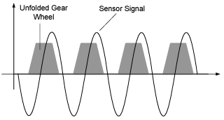
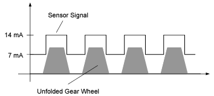

# Wheel Speed Sensors

Wheel-speed sensors are used to measure the rotational speed of the vehicle wheels (wheel speed). The speed signals are transmitted via cables to the ABS, TCS or ESP control unit of the vehicle which controls the braking force individually at each wheel.

With passive sensors, there is usually an encoder wheel made of ferromagnetic material which closely runs past a magnet surrounded by a coil. This results in a constant change of the magnetic flux density which induces a voltage in the coil.

Active sensors often use an encoder wheel made of alternately opposing magnetized segments – the signal is generated in an active circuit by measuring the magnetoresistance or the Hall effect in a sensor.

## Passive sensors - Type DF6

A sensor of type “DF6” is a passive sensor consisting of a magnet wrapped in a coil in the vicinity of an encoder gear wheel

The coil and the magnet are mounted on the vehicle or the axle – the movement of the teeth of the encoder wheel along one pole of the permanent magnet generates an AC signal in the coil which is routed to the corresponding ECU.

The resulting sensor signal approximates the form of a sinusoidal signal as seen on the picture below

Every tooth generates a period of the sinusoidal oscillations – the signal amplitude depends on the size of the gap between the individual teeth (the air gap) and the speed. The greater the speed and the smaller the gap, the greater the induced voltage.

## Active Sensor - Type DF10

A sensor of type “DF10” is an active sensor in which the signal amplitude is independent of the speed.

The magnetoresistance is made use of here which leads to the electrical resistance of certain materials changing when they are brought into contact with a magnetic field. Oscillations of the magnetic flux density correspondingly lead to fluctuations in the resistance.

In addition to the actual sensor element, magnetoresistance sensors consists of a permanent magnet and a two-wire connection for the power supply (battery voltage) and the sensor signal.

This sensor is then positioned on the gear wheel so that there are changes in the resistance due to changes in the flux density between the tooth and the gap. The post-connected evaluation unit then returns defined currents of 7mA (gap) or 14mA (tooth).

The advantage of this principle is that the output signal is not speed-dependent and thus speeds to value 0 can be acquired.