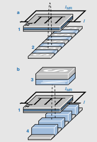
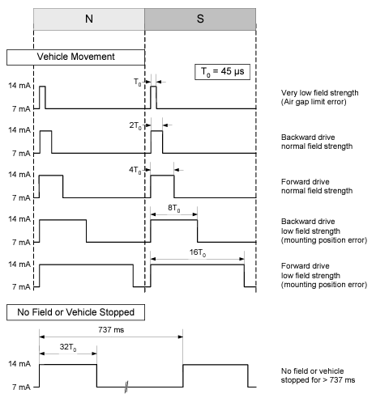
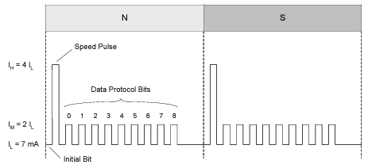

# Wheel Speed Sensors

Wheel-speed sensors are used to measure the rotational speed of the vehicle wheels (wheel speed). The speed signals are transmitted via cables to the ABS, TCS or ESP control unit of the vehicle which controls the braking force individually at each wheel.

With passive sensors, there is usually an encoder wheel made of ferromagnetic material which closely runs past a magnet surrounded by a coil. This results in a constant change of the magnetic flux density which induces a voltage in the coil.

Active sensors often use an encoder wheel made of alternately opposing magnetized segments – the signal is generated in an active circuit by measuring the magnetoresistance or the Hall effect in a sensor.

A typical feature of the active wheel-speed sensor is the integration of a Hall measuring element, signal amplifier and signal conditioning in an IC. The Hall measuring element is located in the continuously changing fields generated by the multipole magnetic ring (a). A steel pulse wheel can also be used instead of the multipole ring. In this case a magnet is mounted on the Hall IC that generates a constant magnetic field (b).

## Passive sensors - Type DF6

A sensor of type “DF6” is a passive sensor consisting of a magnet wrapped in a coil in the vicinity of an encoder gear wheel

The coil and the magnet are mounted on the vehicle or the axle – the movement of the teeth of the encoder wheel along one pole of the permanent magnet generates an AC signal in the coil which is routed to the corresponding ECU.

The resulting sensor signal approximates the form of a sinusoidal signal as seen on the picture below

Every tooth generates a period of the sinusoidal oscillations – the signal amplitude depends on the size of the gap between the individual teeth (the air gap) and the speed. The greater the speed and the smaller the gap, the greater the induced voltage.

## Active Sensor - Type DF10

A sensor of type “DF10” is an active sensor in which the signal amplitude is independent of the speed.

The magnetoresistance is made use of here which leads to the electrical resistance of certain materials changing when they are brought into contact with a magnetic field. Oscillations of the magnetic flux density correspondingly lead to fluctuations in the resistance.

In addition to the actual sensor element, magnetoresistance sensors consists of a permanent magnet and a two-wire connection for the power supply (battery voltage) and the sensor signal.

This sensor is then positioned on the gear wheel so that there are changes in the resistance due to changes in the flux density between the tooth and the gap. The post-connected evaluation unit then returns defined currents of 7mA (gap) or 14mA (tooth).

The advantage of this principle is that the output signal is not speed-dependent and thus speeds to value 0 can be acquired.

## Active Sensor - Type DF11i

While sensors of types “DF6” and “DF10” only provide the relevant ECU with information on the wheel speed, sensors of the type “DF11i” (and of type “VDA”) output pulse-width modulated signals in which additional information such as direction of rotation and magnetic field strength are coded. These sensors are active sensors whose functioning is based on the Hall effect.

n most cases, the encoder wheel consists of plastic elements (mounted on a non-magnetic metallic carrier) of opposing magnetization which results in a sign change of the Hall voltage on rotation.

It is, however, also possible for the encoder wheel to be made of a ferromagnetic material – in this case, the Hall element is positioned on a permanent magnet. The change between tooth and gap of the encoder wheel leads to a change of the magnetic flux density and thus to fluctuations in the Hall voltage.

The signals ultimately provided by the sensor consist of current pulses of 14mA (low=7mA) whose frequency is proportional to the speed and whose rising edges have a precise temporal relationship to the change of the segments.

The pulse width is determined by the direction of rotation and the field strength: It consists of multiples of a well-defined time interval.

When the encoder wheel is paused or there is no change to the sensor signal for another reason, a standstill pulse with approx. 1.5Hz repetition rate is output.

The output signals of the DF11i sensor are described in the picture below

## Active Sensor - Type DF30/VDA

DF30/VDA sensors are also active sensors and, like the “DF11i” sensors, are based on the Hall effect. The following figure shows the output signal of this sensor.

The speed pulse is output at every “edge” of the encoder wheel – the current IH of this pulse is four times the low level IL=7mA. An initial bit that sets the current level to IL precedes this pulse. A further nine bits follow the speed pulse with a current level of IH=2IL.

AK protocol contains information related to magnetic strength of the signal, sensor calibration mode, encoder sense of rotation and parity. These data protocol bits are binary in nature and are embedded with information that can be utilized further to develop diagnostics and prognostics around it.

Description of VDA bits outputted from AK Protocol based WSS in the table below.

|Bit Number|Name |Description|
|---|---|---|
|0 |Airgap Reserve |1 Magnetic strength too low to stay in normal mode |
|1 |Status Mode |0 Calibrated Mode, 1 Uncalibrated Mode |
|2 |Advanced Protocol |1 Transmission of advanced AK protocol is enabled |
|3 |Validity of Direction of Rotation |1 if Direction is valid |
|4 |Direction of Rotation |0 if clockwise, 1 if anticlockwise |
|5 |LM0 (LSB) |Gap indication, lowest significant bit |
|6 |LM1 |Gap indication, medium significant bit |
|7 |LM2(MSB) |Gap indication, most significant bit |
|8 |Parity |1 for even parity, P = XOR (bit 0 to bit 7) |

The quality of the wheel speed signal depends on the magnetic strength. Any deterioration in the health of the wheel encoder will also impact the magnetic strength of the signal. Therefore, presence of magnetic debris on the surface of the encoder will hamper the quality of wheel speed signal. VDA bits 5-7 which can be converted to a 3-bit integer (7-Maximum magnetic strength, 0-Minimum magnetic strength) which correlates to the magnetic strength at the interface and shows potential to determine faults at the interface.
