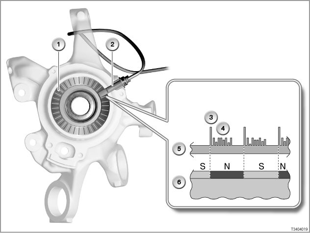

# MK60e5-Standalone

Documenting everything required to run MK60e5 ABS/DSC unit as standalone outside of it's original chassis.

## Introduction

BMW 3-Series vehicles with 6-cylinder engine are equipped as standard with Dynamic Stability Control Mk60E5. This version is an advanced development of DSC Mk60E used on the E87. On the DSC Mk60E in the E87, the brake pressure sensor was integrated in the DSC unit (compared to the DSC Mk60). The DSC Mk60E is also fitted on E90/E91 vehicles with 4-cylinder engine. The supplier for both DSC Mk60E and DSC Mk60E5 is Continental Teves.
DSC Mk60E5 was installed on the following vehicles:

- E87 with 6-cylinder engines from 9/2005
- E85 from 1/2006, E86 from 4/2006
- E90, E91 with 6-cylinder engines from 9/2006, E92 6/2006, E93 12/2006

Note: BMW E9x vehicles with all-wheel drive are equipped as standard with Bosch DSC 8Plus.

## Active Wheel Speed sensors (VSS)

Installed on BMW E87 with Inline 6 and E9x and later models. A wheel-speed sensor is installed on each wheel. There is a ring of magnets (96 pole) around the wheel bearing (increment wheel). The north and south poles of the increment wheel alternate.
One north pole with one south pole constitutes one increment (cf. tooth/gap on an increment gear).
The wheel-speed sensor consists of the actual sensor and an electronic evaluation unit.

|Item|Description|
|---|---|
|1 |Wheel bearing with increment wheel (magnetic ring) |
|2 |Wheel speed sensor |
|3 |Pulse for speed of rotation |
|4 |Additional information, for example direction of rotation and air gap |
|5 |Signal path |
|6 |Wheel bearing with magnets |

Each increment generates 2 pulses in the wheel-speed sensor (96 pulses/revolution of wheel). For the data transmission to the control unit, additional data are added alongside the pulse. Functionally, this integrated data processing goes beyond the simple recording of speed of rotation

The wheel speed sensor part numbers from BMW ETK Online:

|Model and Year|Front|Rear|Notes|
|---|---|---|---|
|E90 320i LCI 2010 LHD |34526762465 |34526762466 |Same sensor on E81, E82, E87, E88 and E9x 4 cylinder gasoline and diesel engines |
|E90 335i LCI 2010 LHD |34526870075 |34526870077 |Same sensor on E81, E82, E87, E88 and E9x 6 cylinder gasoline and diesel engines as well as on some N43 and N47 engine cars |
|E90 M3 LCI 2010 LHD |34527853586 |34526870077 |Front sensor only on M3, rear sensor same on E81, E82, E87, E88 and E9x 6 cylinder gasoline and diesel engines as well as on some N43 and N47 engine cars |
|E85 Z4  LHD |R:34526792896, L:34526792897 |34526757281 |Front sensor same on all E85, E86 and E46. Rear sensor same on all E85, E86 |

The following page describes additional technical information on various [vheel speed sensors](MK60E5-Components/WheelSpeedSensors.md).

## DSC Sensor

The DSC sensor measures the rotation of the vehicle around the vertical axis (yaw rate) and the lateral acceleration of the vehicle.

The DSC sensor part numbers from BMW ETK Online:

|Model and Year|Unit |Notes|
|---|---|---|
|E90 320i LCI 2010 LHD |34526850374 |Same DSC sensor on E81, E82, E87, E88 and E9x 4 cylinder gasoline and diesel engines |
|E90 335i LCI 2010 LHD |34516784961 |Same unit on E81, E82, E87, E88 and E9x 6 cylinder gasoline and diesel engines as well as on some N43 and N47 engine cars |
|E90 M3 LCI 2010 LHD |34526850375 |Same unit on E81, E82, E87, E88 and E9x 6 cylinder gasoline and diesel engines |
|E85 Z4 2008 LHD |34526769174 |Same on all E85, E86 after 2006 |

The following page describes additional technical information for [DSC sensor](MK60E5-Components/DSCSensor.md)

## DSC Unit

...

The DSC unit part numbers from BMW ETK Online:

|Model and Year|Unit |Notes|
|---|---|---|
|E90 320i LCI 2010 LHD |34516863354 |Same unit on E81, E82, E87, E88 and E9x 4 cylinder gasoline and diesel engines |
|E90 335i LCI 2010 LHD |34516863356 |Same unit on E81, E82, E87, E88 and E9x 6 cylinder gasoline and diesel engines as well as on some N43 and N47 engine cars |
|E90 M3 LCI 2010 LHD |34507841955 |Unit only on M3 (Old part number: 34507841233) |
|E85 Z4 2008 LHD |34516778490 |Same on all E85, E86 after 2006 |

## Steering Angle sensor

...

## DTC Button

...

## DSC system functions

DSC uses brake actions and engine intervention to influence longitudinal and lateral dynamics.

Functions familiar from current DSC (MK60):

- ABS: Anti-lock braking system
- EBV: Electronic brake force distribution
- CBC: Cornering Brake Control
- ASC: Automatic stability control
- DTC: Dynamic traction control
- MSR: Engine drag torque control
- DBC: Dynamic brake control
- RPA: Run Flat Indicator (not a driving dynamic control function)
- CBS: Condition Based Service (not a driving dynamic control function)

New functions for DSC Mk60E5:

- Brake Standby through pre-tensioning of the brakes in an emergency
- Brake disc drying on wet roads
- Fading compensation
- Soft stop when braking to standstill (only E87 with 6-cylinder engine, E90, E91, E92, E93)
- Start-off assistant
- Adapted interface for cruise control with brake function (only E90, E91, E92, E93)
- Adapted interface for active cruise control (only E90, E91, E92, E93)
- Yaw-moment compensation via active steering (only E87 with 6-cylinder engine, E90, E91, E92, E93)

## References

- BMW TIS
- BMW ETK Online
- Bosch Professional Automotive Information: Brakes, Brake Control and Driver Assistance Systems, Konrad Reif, ISBN978-3-658-03977-6
- [MK60e5 and MK60 ABS retrofit group](https://www.facebook.com/groups/807702710448164)
- [BMW MK60 Motorsports ABS](https://www.facebook.com/groups/1056638784424876)
- [Standalone ABS Installs (MK60 and More)](https://grassrootsmotorsports.com/forum/grm/standalone-abs-installs-mk60-and-more/248099/page1/)